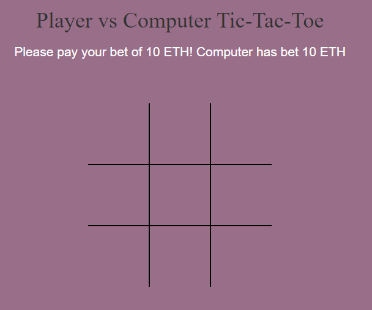
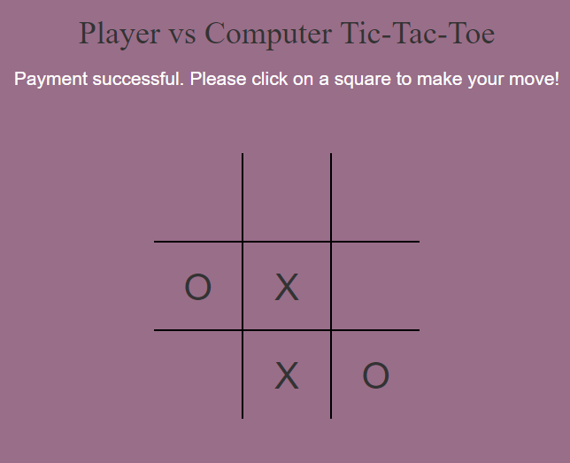
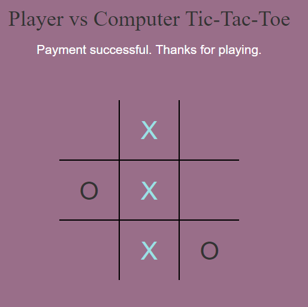

# Tic Tac Toe	

This is a simple Tic Tac Toe game developed using: 
- web3.js 
- truffle 
- solidity 
- node.js

Developed by [Suresh Reddy](https://www.linkedin.com/in/suresh-reddy-7545842b/)

## Description
Anyone with a Ethereum wallet can play this simple game. 

This game is played against computer. 

Steps:
1. Initially computer keeps 10 ETH with the contract
2. Before the game starts, the player also has to deposit 10 ETH with the contract. Approve this using metamask.
3. After the game is over, the winner will be transferred 20 ETH excluding the gas. Here also, the player has to approve using metamask.

## Software requirements
- Ganache (or Geth etc)
- Node 
- Truffle
- Metamask (the game runns fully on the browser side, so Metamask will be used to connect to the Ethereum blockchain)

## Setup
Run this in sequence in the root folder of the project:
- Run Ganache
- truffle compile
- truffle migrate --reset
- npm run dev

## Demo

Home Page

During the game 

After game is over

## Next steps
- Implement "Play again" feature. 
- Provide two player option. 

License
-------------
Free :-)

